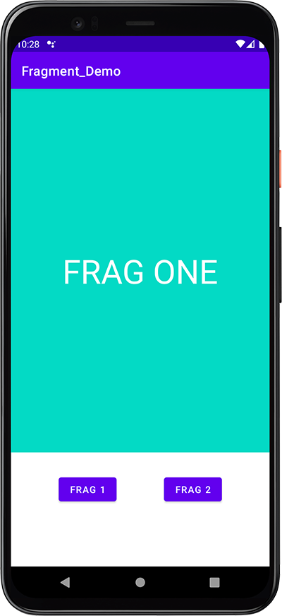

# Fragment Demo

How to create fragments in Android Studio with Java

## YouTube Tutorial

I haven't made a video tutorial for this project yet. Subscribe to my channel to get updated if I do. https://bit.ly/3MBVF1E

## Project Info

Demonstrates how to create and implement fragments in Java. Simple project that creates two fragments and two buttons to switch between the fragment views.

## Screenshot

